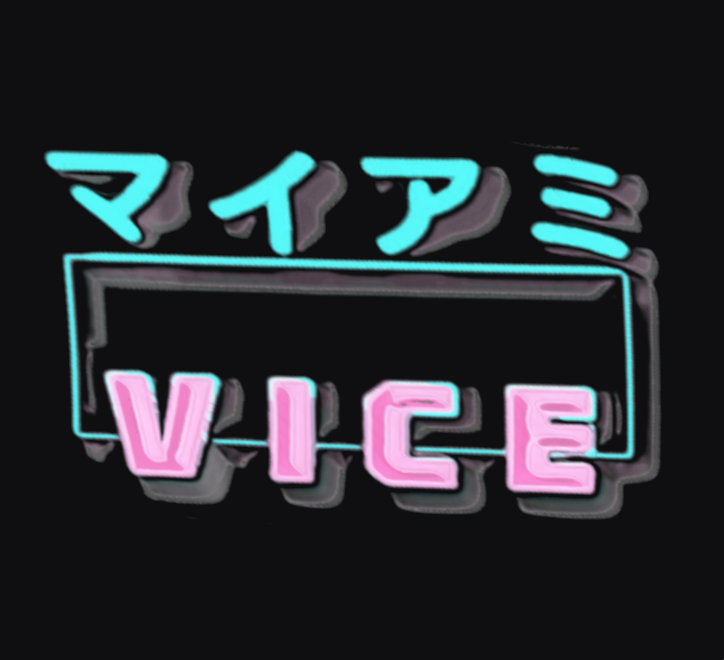
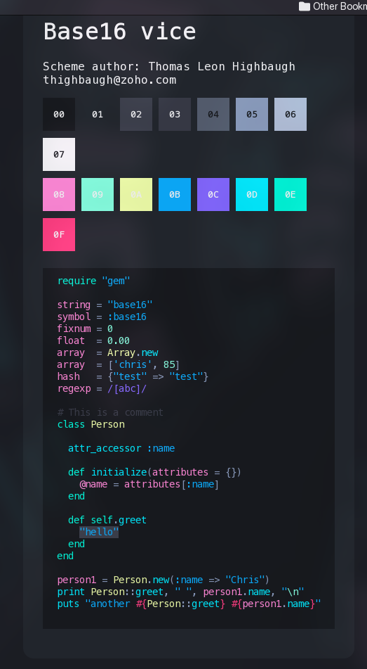
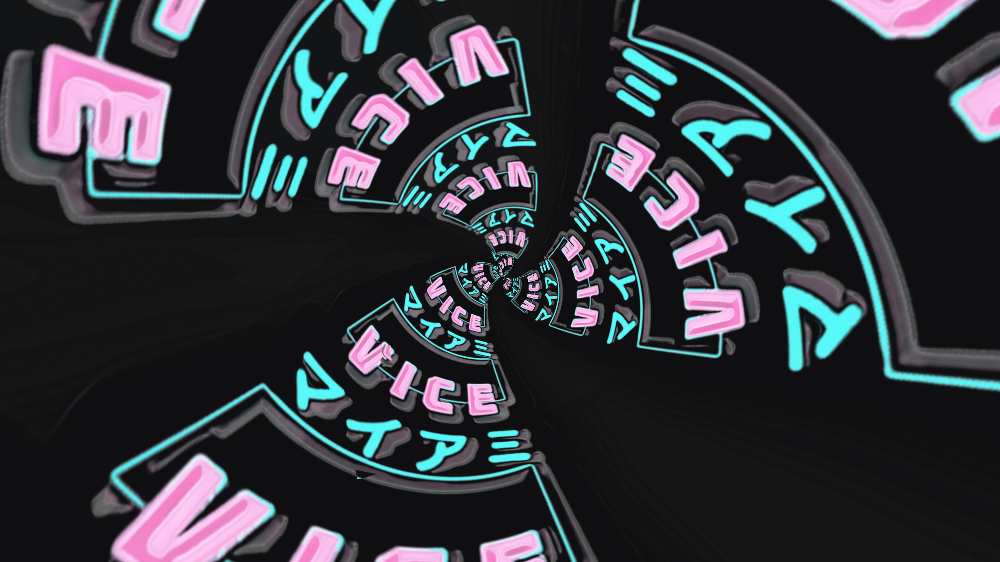

# Base16 Vice Scheme

A colorscheme for Base16 inspired by Miami Vice and crafted for use across my GUI and TUI interfaces day and night (no red light filtering)

---

<h1> V I C E </h1>

A base16 theme with plenty of blue, but still doesn't hurt your eyes looking at it all night in a dark room due to the blending of the white text color with a suitable black, **and lots** of testing by its author.

 

## G A L L E R Y

Let's face it, seeing is believing and especially with base16 schemes, you want to know before you go through the trouble of setting all your apps up with it that you like it. So here is a gallery of the theme colors in action, as well as some of the artwork I have made to accompany the scheme and as backgrounds in my customized Linux environments that employ it

